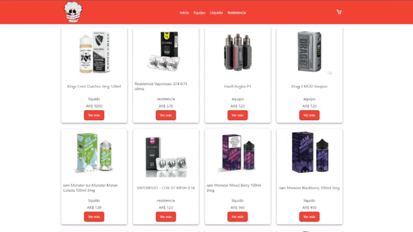

  
  <h1>Proyecto E-Commerce Coderhouse</h1>
  

    Proyecto realizado durante el cursado de React en Coderhouse.
  

<!-- Badges -->

  
  
  </a>
  
  
  

<h4>
    <a href="https://app-vapeshop.netlify.app/">Ver Demo</a>
  </h4>

 

<!-- Table of Contents -->

# :notebook_with_decorative_cover: Table of Contents

- [:notebook_with_decorative_cover: Table of Contents](#notebook_with_decorative_cover-table-of-contents)
  - [:star2: Acerca del proyecto](#star2-acerca-del-proyecto)
    - [:camera: Screenshots](#camera-screenshots)
  - [:space_invader: Tecnologías usadas](#space_invader-tecnologías-usadas)
<!-- About the Project -->

## :star2: Acerca del proyecto

<!-- Screenshots -->

### :camera: Screenshots

 
  

<!-- TechStack -->

## :space_invader: Tecnologías usadas

* [React.js](https://reactjs.org/)
  * React es el framework de Javascript que elegí para este proyecto, ya que además de ser la tecnología a aprender en el curso, es la que más me interesa personalmente.
* [React Router](https://reactrouter.com/)
  * React por sí mismo no tiene un sistema de navegación por defecto, por lo que elegí React Router Dom. El hecho de ser la librería más usada para navegación, me da la ventaja de poder contar con una gran documentación para facilitar el desarrollo.
* [Create React App](https://create-react-app.dev/)
  * Este proyecto se construyó usando Create React App.
* [React Toastify](https://www.npmjs.com/package/react-toastify)
  * Libreria que permite incorporar notificaciones a la aplicacion.
* [Sass](https://sass-lang.com/)
  * Preprocesador de CSS.
* [Firebase](https://firebase.google.com/)
  * Firebase es una herramienta de hosting de datos que me permitió crear una base de datos lo suficientemente completa como para que sirva en este proyecto.
* [Netlify](https://www.netlify.com/)
  * Netlify es una herramienta de hosting que me permitió hacer un deploy de mi proyecto de forma gratuita.
* [Prettier](https://prettier.io/)
  * Prettier es una librería que me permitió hacer un formato de código más legible, eliminando cualquier inconsistencia que pudiera generar sin darme cuenta.
